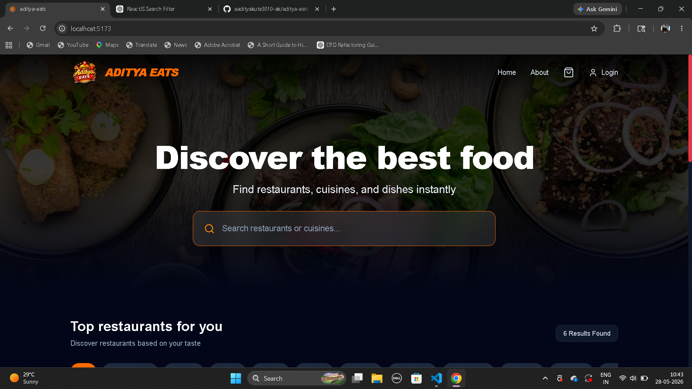
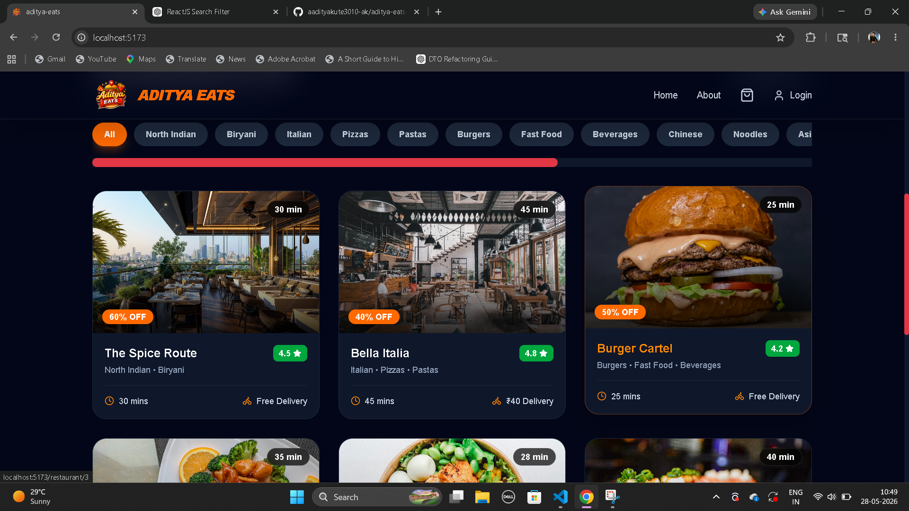
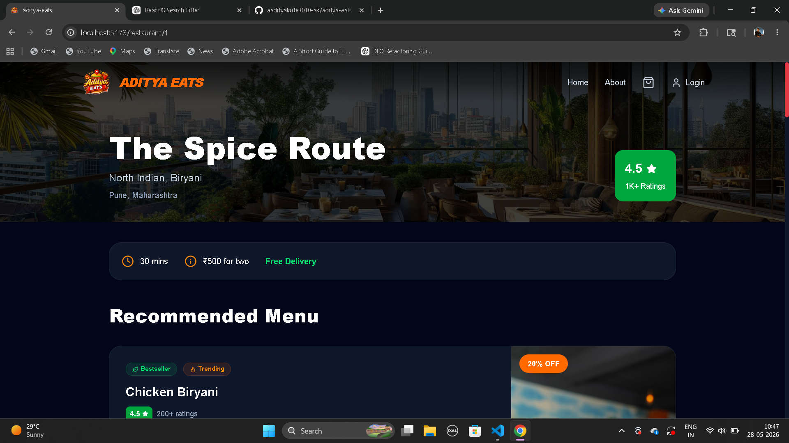
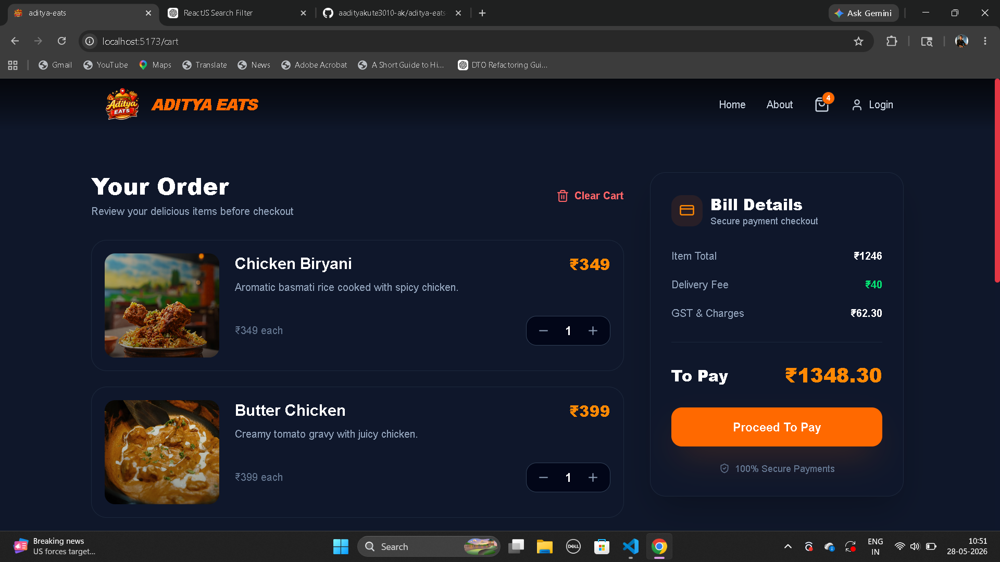
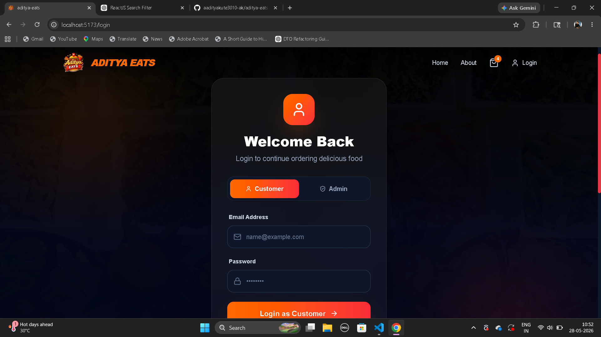
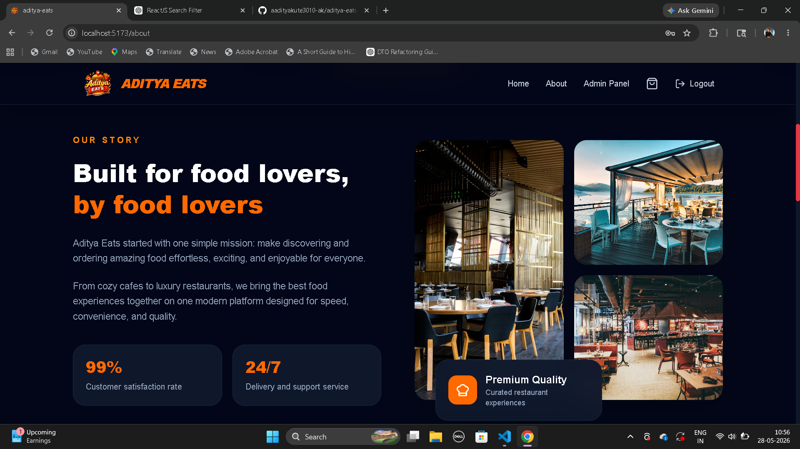
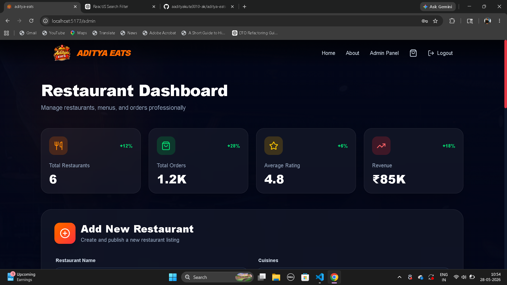

# 🍽️ Aditya Eats

### Modern Food Delivery Web Application

<p align="center">
  
  
  
  
</p>

---

## 🚀 Overview

**Aditya Eats** is a modern and visually stunning food delivery web application inspired by platforms like Swiggy and Zomato.
Built with a focus on **premium UI/UX**, responsiveness, performance, and scalable frontend architecture.

The application provides users with a seamless experience for browsing restaurants, exploring cuisines, managing carts, and placing orders — all wrapped inside an elegant dark-themed interface.

---

# ✨ Features

## 🍕 User Features

* 🔍 Smart restaurant & cuisine search
* 🍔 Dynamic restaurant detail pages
* 🛒 Fully functional cart system
* ➕ Add / Remove item quantity management
* 🔔 Beautiful toast notifications
* 🎨 Smooth animations & hover interactions
* 📱 Fully responsive across all devices
* 🌙 Modern glassmorphism dark UI
* ⚡ Lightning-fast Vite performance

---

## 👨‍💼 Admin Features

* ➕ Add restaurants
* 🍽️ Manage menu items
* 🖼️ Upload restaurant image URLs
* 📊 Professional admin dashboard UI

---

# 🛠️ Tech Stack

| Technology       | Purpose             |
| ---------------- | ------------------- |
| React.js         | Frontend Library    |
| Redux Toolkit    | State Management    |
| React Router DOM | Routing             |
| Tailwind CSS     | Styling             |
| Vite             | Build Tool          |
| React Hot Toast  | Notifications       |
| SweetAlert2      | Professional Alerts |
| Lucide React     | Icons               |

---

# 🎨 UI Highlights

* Premium dark-themed interface
* Glassmorphism navbar
* Dynamic search suggestions
* Animated cards & transitions
* Professional cart sidebar
* Interactive admin dashboard
* Smooth hover & scaling effects

---

# 📸 Screenshots

## 🏠 Home Page



---

## 🍽️ Restaurants


---

## 🍽️ Restaurant Details


---

## 🛒 Cart Page


---

## 🔐 Login Page



---

## 🍽️ About Page



---

## 👨‍💼 Admin Dashboard



---

# ⚙️ Installation & Setup

## 1️⃣ Clone Repository

```bash
git clone https://github.com/aadityakute3010-ak/aditya-eats-foodDeliveryApp.git
```

---

## 2️⃣ Navigate to Project

```bash
cd aditya-eats-foodDeliveryApp
```

---

## 3️⃣ Install Dependencies

```bash
npm install
```

---

## 4️⃣ Run Development Server

```bash
npm run dev
```

---

# 📂 Project Structure

```bash
src/
│
├── assets/
├── components/
├── data/
├── pages/
├── redux/
├── App.jsx
├── main.jsx
└── index.css
```

---

# 🌟 Future Enhancements

* 💳 Payment Gateway Integration
* 🔐 Real Authentication System
* ☁️ Firebase / MongoDB Backend
* 📦 Order Tracking
* ❤️ Wishlist Feature
* 🌐 Live API Integration
* 🤖 AI Food Recommendations

---

# 👨‍💻 Developer

### Aditya Kute

Passionate Frontend Developer focused on creating modern, premium, and scalable web experiences.

🔗 GitHub:
https://github.com/aadityakute3010-ak

---

# ⭐ Support

If you liked this project:

* 🌟 Star the repository
* 🍴 Fork the project
* 🛠️ Contribute improvements

---

<p align="center">
  Made with ❤️ using React + Tailwind CSS
</p>
